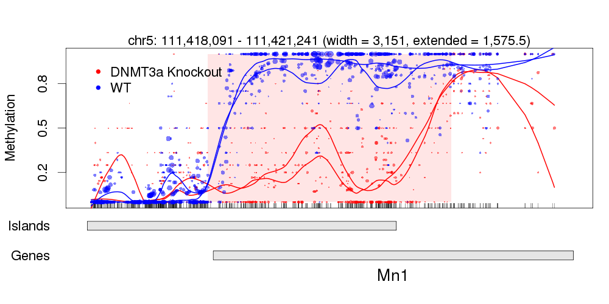
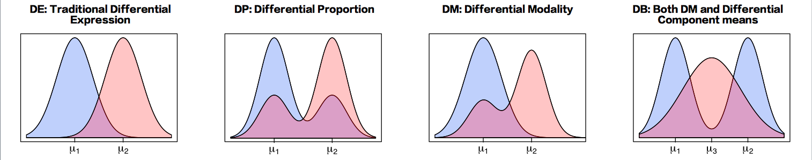
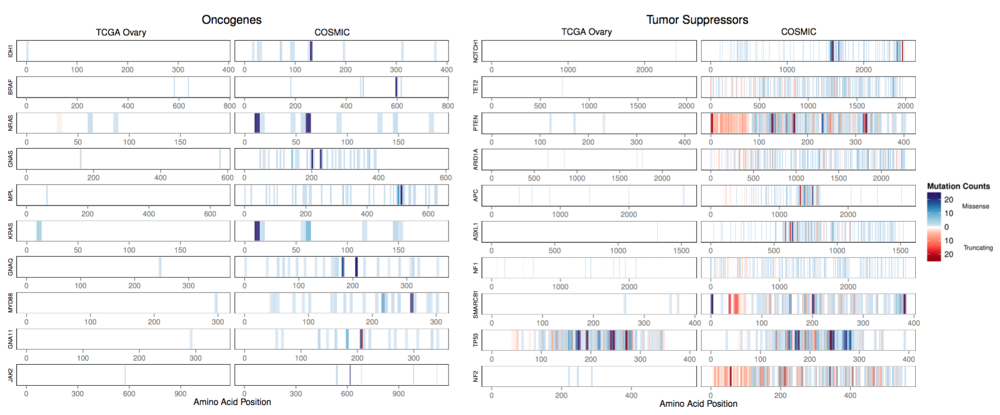
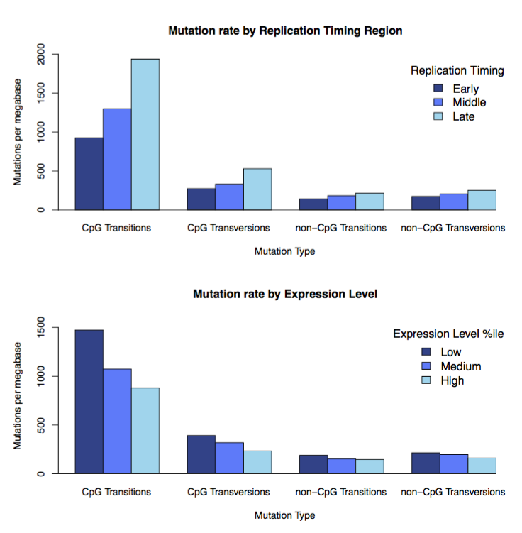
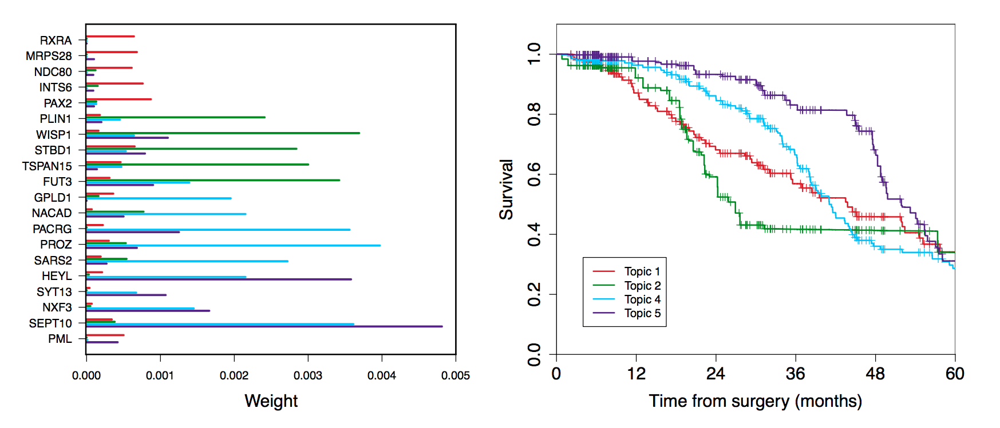

### publications

- [Google scholar](https://scholar.google.com/citations?user=spd-KjUAAAAJ&hl=en)
- [Curriculum Vitae](../cv-korthauer-academic.pdf)
        		
### software

I develop open-source, freely available software for the analysis of 
high-throughput genomic data. My code is available through R packages that
can be installed from [GitHub](https://github.com/kdkorthauer) 
or the [Bioconductor](https://bioconductor.org) Project.

- **dmrseq**: R package for inference for differentially methylated regions (DMRs) from bisulfite sequencing, available on [GitHub](https://github.com/kdkorthauer/dmrseq) 
		       
- **scDD**: R package for the identification of differentially distributed genes in single-cell RNA-seq, available on [Bioconductor](http://bioconductor.org/packages/scDD)
		    
- **MADGiC**: R package for the identification of cancer driver genes by integrating somatic mutation, expression, replication timing, and functional impact, available on [GitHub](https://github.com/kdkorthauer/MADGiC)
				    
### research interests 

#### detection and inference of differential methylation

A central question in the analysis of bisulfite sequencing data is to detect regions, or collections of neighboring CpGs, with systematic differences between conditions, as compared to within-condition variability. These so-called Differentially Methylated Regions (DMRs) are thought to be more informative than single CpGs in terms of biological function. However, current computational approaches for detecting such regions do not provide accurate statistical inference. A major challenge in reporting uncertainty is that a genome-wide scan is involved in detecting these regions, which needs to be accounted for. A further challenge is that sample sizes are limited due to the costs associated with the technology. We have developed a new approach that overcomes these challenges and assesses uncertainty for differentially methylated regions in a rigorous manner. 

 

The R package dmrseq (available on [GitHub](https://github.com/kdkorthauer/dmrseq)) provides a rigorous permutation- based approach to detect and perform inference for differential methylation by use of generalized least squares models that account for inter-individual and inter-CpG variability to generate region-level statistics that can be comparable across the genome. We find that the new method improves the specificity and sensitivity of lists of regions and accurately controls the False Discovery Rate (FDR) in experiments with as few as two samples per group. Learn more b   	  

#### characterizing complex differences in single-cell gene expression 

With collaborators at UW's Morgridge Institute for Research, we developed a method to detect differences in expression from single-cell RNA-seq experiments that explicitly accounts for the possibility of multiple distinct expression states within and among biological conditions. The ability to detect distinct expression states is a key advantage of single-cell technologies since measurements do not represent averages over populations of cells, as in bulk RNA-seq. In contrast to traditional differential expression analyses, which generally assume differences can be characterized by a mean shift, we use flexible nonparametric Bayesian mixture modeling to detect subgroups of cells expressing a given gene and determine whether they differ by condition.

In addition to detecting genes with subtle and complex differences in expression among single-cells, the framework also provides a summary of the key features than can differ between two conditions by classifying them into meaningful patterns.  The predominant features that are represented by the patterns are differences in means, differences in the number of subgroups, and differences in the proportion of cells belonging to each subgroup. Compared to methods that do not account for distinct expression states, our method shows increased sensitivity in simulation, and is able to detect and classify changes in key pluripotency genes and cell cycle regulators when comparing differentiated cells to embryonic stem cell lines.
              
The scDD R package that implements our approach is available on [Bioconductor](http://bioconductor.org/packages/scDD). Read more in our [Genome Biology paper](https://genomebiology.biomedcentral.com/articles/10.1186/s13059-016-1077-y) 

#### identifying Driver Genes in Cancer 

We know that cancer arises from the accumulation of genetic alterations that provide a selective advantage to a cancer cell (drivers), but identifying which changes will provide that advantage is a difficult and open problem. Alterations that are irrelevant to the disease process (passengers) will occur by chance and the key challenge is to be able to separate these two classes of alterations. We have developed a statistical method to address this problem called MADGiC (a Model-based Approach for identifying Driver Genes in Cancer. 

 

 

As we detail in the manuscript published in [Bioinformatics](http://bioinformatics.oxfordjournals.org/content/early/2015/01/07/bioinformatics.btu858.long), existing statistical methods for identifying driver genes in cancer rely primarily on frequency-based criteria (i.e. identifying driver genes as those showing higher mutation rates than expected by chance). However, recent studies have 	        
identified many other properties of drivers such as increased functional impact, enrichment for 
specific mutations, and highly structured spatial patterns that have not yet been utilized in statistical approaches. Our approach incorporates all three of these criteria and in doing so shows substantially increased power (with a well controlled false discovery rate) over competing methods in simulation studies.

The R package MADGiC (available on [GitHub](https://github.com/kdkorthauer/MADGiC)) fits an empirical Bayesian hierarchical model to obtain posterior probabilities that each gene is a driver. The model accounts for (1) frequency of mutation compared to a sophisticated background model that accounts for gene-specific factors in addition to mutation type and nucleotide context, (2) predicted functional impact (in the form of SIFT scores) of each specific change, and (3) positional patterns in mutations that have been deposited into the COSMIC (Catalogue of Somatic Mutations in Cancer) database. Example data from the The Cancer Genome Atlas (TCGA) project ovarian cohort is provided. 

#### predicting cancer subtypes using topic models

Latent Dirichlet allocation models, also referred to as topic models, are commonly applied to text corpora to discover underlying themes in the text. Supervised versions of topic models do so while relating topics to an outcome of interest. Instead of literal documents, we applied supervised topic models to diverse genomic data in order to discover cancer subtypes. Here, a topic represents a collection of co-occurring genomic features.
        	 

 
 
Personalized genomic medicine aims to predict clinical response using genomic predictors, but integration of multiple data types (e.g. gene expression, methylation, SNP genotypes) remains a challenge.  Using a novel translation of diverse genomic information to construct patient-specific 'documents', we are able to discover collections of genomic features in cancer patients that are related to survival. As we demonstrate in simulation studies, this type of inference is feasible even with modest sample sizes.  However, more exploration is needed to determine the optimal way to translate the genomic features into 'documents'. See our [ chapter](http://www.cambridge.org/us/academic/subjects/statistics-probability/statistics-life-sciences-medicine-and-health/advances-statistical-bioinformatics-models-and-integrative-inference-high-throughput-data) in _Advances in Statistical Bioinformatics_ (chapter 18) to learn more.
  